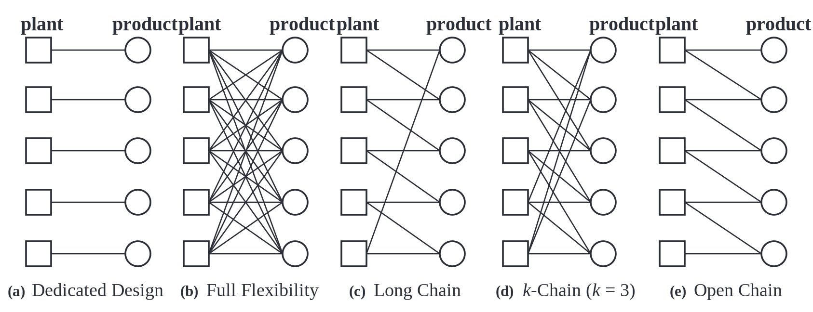

# Notes

- **Reducing Traffic Incidents in Meal Deliveries: Penalize the Platform or Its Independent Drivers?** MSOM (2026) Wenchang Zhang, Christopher S. Tang, Liu Ming, Yue Cheng

  - The main conclusion is that ==*penalizing the platform is more effective than directly penalizing drivers in reducing meal-delivery traffic incidents.*==
  - The key mechanism is that unsafe driving is not modeled as purely driver-initiated behavior. Instead, it is induced by the platform’s aggressive delivery-time promises and commission design.
  - The model has four parties: the government, the platform, customers, and independent drivers.
    - The government first chooses the penalty scheme $(A,R)$, where $A$ is the penalty on drivers and $R$ is the penalty on the platform.
    - The platform then observes $(A,R)$ and customer type $(x,v)$, and chooses the delivery fee $kx$ and driver commission $bx$ to maximize expected profit.
    - The customer utility is $\sigma(x,v,k,t)=v-kx-\beta t$, where $x$ is delivery distance, $v$ is meal valuation, $kx$ is the delivery fee, and $\beta t$ is waiting-time disutility.
    - The driver chooses whether to accept the order and how fast to deliver. The driver’s expected earning rate is $u(t;b,x,A)=(1-G(t;x))bx/t-G(t;x)A$, where $G(t;x)$ is the incident probability.
    - The platform profit is $\pi=(1-G(t;x))[\gamma+(k-b)x]-G(t;x)R$, where $\gamma$ is the platform’s restaurant-side revenue and $R$ is the platform penalty after an incident.
    - The government maximizes total social surplus, which includes platform profit, customer surplus, driver earnings, and public safety benefits: $S=\pi^*+\sigma^*+u^*T^*+(1-G(T^*))P$.

- **Evolution of Ride Services: From Ride Hailing to Autonomous Vehicles** MS (2026) Daehoon Noh, Tunay I. Tunca, Yi Xu

  - Perfect characterization between the AV model and RH model:
    - **AV model**: Its main decisions are capacity $K$ and price $p_V$. Supply is fixed by its own investment, so $S_V=K$, and profit is $\Pi_V=(p_V-c_V^o)D_V-c_fK$. The key feature is fixed capacity investment: AV has direct control over supply but must bear the upfront capacity cost $c_fK$.
    - **RH model**: The RH firm is a ride-hailing platform that does not own vehicles. Its main decisions are the driver revenue share $\alpha$ and price $p_R$. Supply $S_R$ is induced through drivers’ participation decisions, where driver payoff is $(\alpha p_R-c_R^o)D_R/S_R$, and platform profit is $\Pi_R=(1-\alpha)p_RD_R$. The key feature is flexible supply adjustment through $\alpha$.
    - **Consumer choice**: utility is $u_C=a-p_i-bD_i/S_i$, where $p_i$ is price and $D_i/S_i = W(D,S)$ captures waiting cost.
    - ==Deserved Extending==: A mixed AV and human driver business model in which a platform can host AVs owned by a third party.

- **Single-Period Multiproduct Inventory Models with Substitution** OR (1999) Yehuda Bassok, Ravi Anupindi, Ram Akella

  - The paper studies a single-period multiproduct inventory model with **full downward substitution**, where a higher-grade product can satisfy lower-grade demand, but not the reverse.

  - Let $P(x,y)$ be the expected profit when the initial inventory is $x$ and the post-order inventory level is $y$:

    $$
    P(x,y)
    =
    -\sum_{i=1}^{N} c_i(y_i-x_i)
    +
    E_D[G(y,D)].
    $$

  - The second-stage allocation decision is characterized by three sets of variables:
    - $w_{ij}$: amount of product $i$ used to satisfy demand class $j$.
    - $u_j$: unmet demand of class $j$.
    - $v_i$: leftover inventory of product $i$.

  - The second-stage profit is:

    $$
    G(y,d)
    =
    \max_{w,u,v}
    \left\{
    \sum_{i=1}^{N}\sum_{j=i}^{N} a_{ij}w_{ij}
    +
    \sum_{i=1}^{N}s_i v_i
    -
    \sum_{j=1}^{N}\pi_j u_j
    \right\}.
    $$

  - The demand-balance constraints are:

    $$
    u_j+\sum_{i=1}^{j}w_{ij}=d_j,
    \qquad j=1,\ldots,N.
    $$

  - The inventory-balance constraints are:

    $$
    v_i+\sum_{j=i}^{N}w_{ij}=y_i,
    \qquad i=1,\ldots,N.
    $$

  - The second-stage allocation problem is a restricted transportation problem:

  - The paper proves that, under its economic assumptions, the optimal second-stage allocation can be found by a greedy algorithm.

  - The greedy allocation rule is:
    - Serve demand class $1$ using product $1$.
    - Serve demand class $2$ first using product $2$, then product $1$ if needed.
    - Serve demand class $3$ first using product $3$, then product $2$, then product $1$.
    - Continue similarly for lower classes.

  - The proof uses the theory of **Monge sequences** in transportation problems.

  - The authors show that the arc ordering induced by downward substitution satisfies a Monge property under their assumptions.
  - Therefore, the greedy allocation is optimal.

  - The paper proves that the expected profit function $P(x,y)$ is:
    - Concave.
    - Submodular.

  - The main conclusion is that ==*full downward substitution creates a structured second-stage allocation problem whose optimal solution can be obtained by a greedy rule rather than by solving a general transportation problem.*==

  - The key OM insight is that ==*if one product has more inventory, the marginal value of another substitutable product decreases.*==

- **Principles on the Benefits of Manufacturing Process Flexibility** MS (1995) William C. Jordan, Stephen C. Graves

  - The paper studies how much process flexibility is needed to capture most of the benefits of total flexibility.

  - The flexibility configuration is represented as a bipartite graph:

    $$
    A=\{(i,j): \text{plant }j\text{ can produce product }i\}.
    $$

  - Given a demand realization $d$ and capacities $c$, the firm allocates plant capacity to products.

  - The shortfall-minimization problem is:

    $$
    V(A)=\min \sum_i s_i,
    $$

    subject to:

    $$
    \sum_{j:(i,j)\in A}x_{ij}+s_i=d_i,
    \qquad \forall i,
    $$

    $$
    \sum_{i:(i,j)\in A}x_{ij}\le c_j,
    \qquad \forall j,
    $$

    $$
    x_{ij}\ge 0,\quad s_i\ge 0.
    $$

  - Expected sales are:

    $$
    E[\text{Sales}(A)]
    =
    E\left[\sum_i d_i - V(A)\right].
    $$

  - The key technical insight is the **subset bottleneck formula**.

  - For a product subset $M$, define:

    $$
    P(M)=\{j:\text{plant }j\text{ can produce at least one product in }M\}.
    $$

  - The accessible capacity for $M$ is: $\sum_{j\in P(M)}c_j$, and the demandof $M$ is $\sum_{i\in M}d_i.$ If $\sum_{i\in M}d_i>\sum_{j\in P(M)}c_j$, then subset $M$ must experience shortfall.

  - Thus:

    $$
    V(A)
    =
    \max_{M}
    \left\{
    \sum_{i\in M}d_i
    -
    \sum_{j\in P(M)}c_j
    \right\}.
    $$

  - The flexibility design is good if every product subset $M$ can access enough capacity.

  - The main conclusion is that ==*a small amount of well-structured process flexibility can capture most of the value of total flexibility.*==

  - The key OM insight is that ==*the value of flexibility is governed by subset-level demand-capacity bottlenecks, not simply by the total number of flexibility links.*==

- **Sustainable AI: Environmental Implications, Challenges and Opportunities** MLSys (2022) Carole-Jean Wu et al.

  - The paper documents several important quantitative facts about the environmental footprint of industrial AI:
    - Meta’s recommendation data increased by 2.4× and 1.9× from 2019 to 2021, leading to a 3.2× increase in data-ingestion bandwidth demand.
    - Meta’s recommendation and ranking model sizes increased by 20× from 2019 to 2021, while GPU memory capacity increased by less than 2× every two years.
    - AI training infrastructure capacity at Meta increased by 2.9× over 1.5 years, and inference infrastructure capacity increased by 2.5×.
    - Meta’s data-center electricity use reached more than 7.17 million MWh in 2020.
    - In Meta’s AI infrastructure, the rough power-capacity breakdown is 10:20:70 across Experimentation, Training, and Inference.
    - For one large recommendation model, the energy footprint is roughly 31:29:40 across Data, Experimentation/Training, and Inference.
    - More than 50% of Meta’s emissions come from Scope 3 value-chain emissions, meaning that embodied carbon from hardware manufacturing is a major component of AI’s total carbon footprint.
    - For large-scale ML tasks, the embodied and location-based operational carbon footprint is roughly split as 30% / 70%; after carbon-free energy is considered, manufacturing carbon can become the dominant source.
    - Hardware-software co-design reduced the operational energy footprint of one Transformer-based language model by more than 800×.
    - Meta achieved an average 20% operational power reduction every six months, but overall AI infrastructure continued to scale, producing a Jevons-paradox effect.

  - The paper addresses the ==carbon-emission== problem faced by AI companies. Its main argument is that AI firms should not evaluate sustainability only by the electricity used to train a single large model. Instead, they must account for the full carbon footprint of AI, including data processing, experimentation, training, inference, hardware manufacturing, data-center operation, and edge/on-device computation. The key issue is that AI firms continuously scale data, models, infrastructure, and inference traffic, so carbon emissions are an ongoing operational and supply-chain problem rather than a one-time model-training cost.

- **A Review of Flexible Processes and Operations** POM (2021) Shixin Wang, Xuan Wang, Jiawei Zhang

  

  - **Independent Capacity Allocations** (Single-period problem)
    - Model: $Z(d,A)=\max \sum_{(i,j)\in A} x_{ij}, s.t. \sum_{i=1}^{m} x_{ij} \le d_j, \sum_{j=1}^{n} x_{ij} \le C_i.$
      - A sparse flexibility design $A$ is $(1-\epsilon)$-optimal in expectation if $E_D[Z(D,A)] \ge (1-\epsilon)E_D[Z(D,F)].$
      - A sparse flexibility design $A$ is $(1-\epsilon)$-optimal in the worst case if $Z(d,A) \ge (1-\epsilon)Z(d,F), \qquad \forall d\in S.$
    - Performance of Long Chain: Leftover capacity: $X \stackrel{d}{=} \max\{0,\, C - (D-X)^+\}.$ When the variability of demand is small, the long chain has a huge performance guarantee. The performance is decreasing in $n$.
    - K-Chain:

      \[
      \lim_{n\to\infty}
      \frac{\mathbb{E}_D[Z(D,C_n^k)]}{\mathbb{E}_D[Z(D,F_n)]}
      \ge
      \frac{k+3}{4}
      -
      \frac{\sqrt{(k-1)^2+4\left(\frac{\sigma}{\lambda}\right)^2}}{4}.
      \]

    - Graph Expander Design: Good sparse flexibility designs should have strong expansion. A bipartite graph $G=(U,W,A)$ is an $(a,\epsilon)$-expander if, for every product subset $V\subseteq W$ with $|V|\le an$,

      $$
      |C_A(V)|>\frac{1-\epsilon}{a}|V|,
      $$

      where $C_A(V)=\{i\in U:(i,j)\in A \text{ for some } j\in V\}$ is the set of capacity nodes connected to $V$. Preventing subset-level bottlenecks and explains why well-connected sparse structures can perform close to full flexibility.

  - **Dependent Capacity Allocations**
    - Multi-period problem: offline allocation + backlog / online allocation + lost sales.

- **Managing Payment Flexibility in Rent-to-Own Contracts for Off-Grid Energy Products** MSOM (2026) Jose A. Guajardo, Elaheh Rashidinejad, Gonzalo Romero, Hosain Zaman
  - The paper models the consumer's effective budget $B_t$ as a geometric random variable, because the probability that the base-of-pyramids consumers have high budget drop significantly.
  - The consumer's repayment decision is a DP problem close to the inventory problem. The state is $(a_t,o_t)$, where $a_t$ is the number of advanced installments already paid and $o_t$ is the number of outstanding installments needed for ownership. Given realized budget $b_t$, the optimal policy has an order-up-to structure: $x_t\in\{0,\ldots,\min(b_t,o_t)\}$.
  - ==*Under some conditions, maximizing firm revenue is equivalent to minimizing the consumer's expected time to ownership: $E[\Pi_1]\ge E[\Pi_2]$ if and only if $E[\tau_1]\le E[\tau_2]$.*==